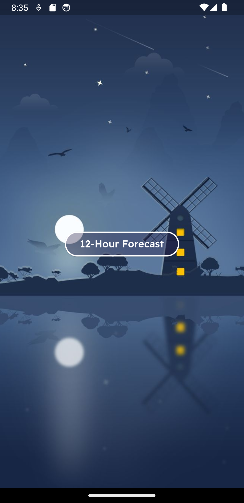
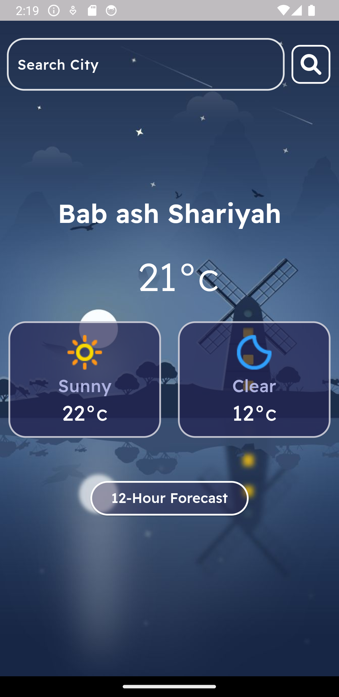
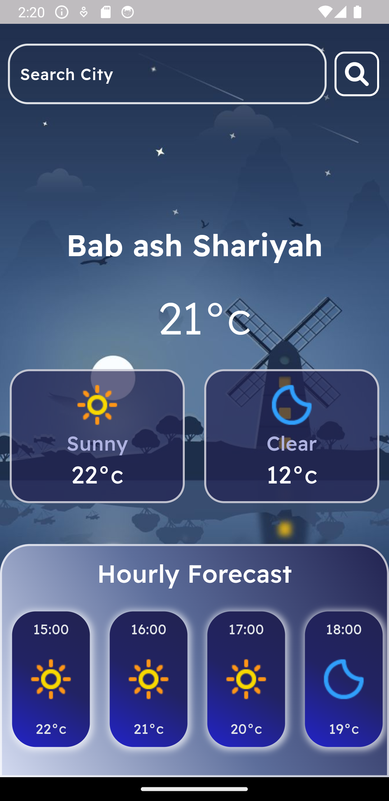
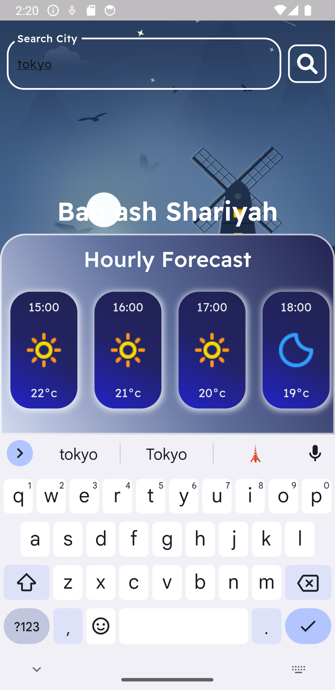
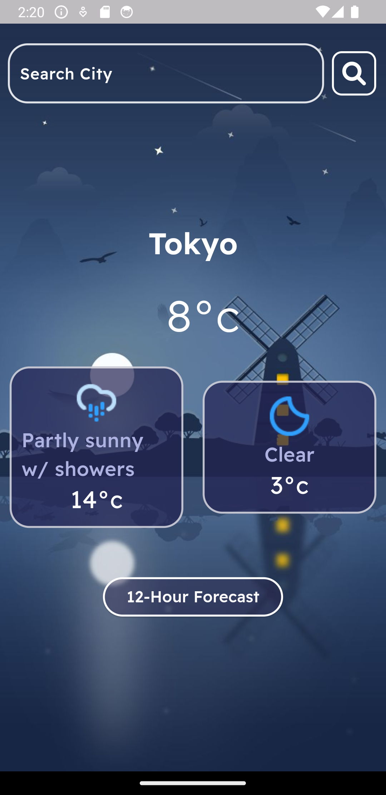

# weatherly

Weather Forecast Application that enables users to search for forecast details about their locations and search for other cities forecast details

## Getting Started

This project is a starting point for a Flutter application.

## Features

- get forecast details by IP
- get 12 hour forecast about the location
- search for desired cities
- auto complete for cities search

## Technologies Used
- API : AccuWeather API
- State Management : Cubit
- http Services : dio, retrofit, json serializable,
- UI/UX : flutterflow
- Dependency Injection : GetIt

## screenshots

